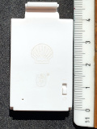
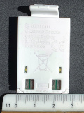
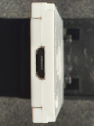

# Bluetooth Battery Remote Control

## Shell Motorsport collection

Shell Oil Company in its gas station offers loyalty program under name Shell
ClubSmart. Members collect points which can be later used to get rewards. In
2020 they have offered a collection of die-cast car models under name Shell
Motorsport. All models of the colletion are equipped with electrical motor. One
of the models - Nissan Formula E Gen 2 Car - contains a battery that can be
used to control a model remotely over Bluetooth. In some markets a battery with
a remote controller is available separately.

## Shell Racing application

Shell offers an application for smart phones named Shell Racing on [Google Play
for Android](https://play.google.com/store/apps/details?id=nl.brandbase.shellsupercars)
and [App Store for iPhone and iPad](https://apps.apple.com/us/app/shell-racing/id1458482004).
It primarily offers a game to race with a cars. In Shell Racing Club section of
the application ClubSmart members can add their membership card which will
allow them race to get reward points. The same application can be used to
remote control cars. The application is available by third party company
BrandBase that provides very good explanation how [Shell Motorsport Bluetooth
Remote Control Collection](https://brand-base.com/project/motorsports-bluetooth-remote-control/)
is used as a campaign tool.

Shell Racing application requires internet connection for the first start:

[](images/shell-racing-first-start.jpg)

and even later for any subsequent start:

[](images/shell-racing-later-start.jpg)

## Motivation to take a control

The car cannot be controlled if internet connection is not available or game
server is not reachable. The application collects information about use of
remote control that is tied to device and could be connected to person who owns
membership card.

I believe a player should be able to control models they own in a way they
desire without being monitored.

Lastly it is interesting to look into the hardware that I have in the
possesion.

## Remote Control Battery

Dimmensions:

- 28mm wide
- 40mm height
- 5mm width

[Hong Kong regional Shell
website](https://www.shell.com.hk/en_hk/motorists/shell-fuels/shell-motorsport-bluetooth-remote-control-car-promotion.html)
provides following additional information:

Bluetooth® remote control distance: 8-10m

Battery charge time (full charge): approx. 30mins

Battery life: 20mins

### Front side

[](images/battery-front.jpg)

Has Shell and Bluetooth logos.

Components:

- on/off switch
- green/orange/blue LED

### Back side

[](images/battery-back.jpg)

Components:

- two white LED
- two pairs of connectors - each with + and - sign underneath

Text:

```
Brandbase
Bluetooth Remote
Control Battery
3.7 Volt 86mAh
Follow instructions
Made in China

FCB0880
MSBT LIPO
```

### Bottom side

[](images/battery-bottom.jpg)

Components:

- micro USB connector

## USB Connection

USB port is used only for charging. Data lines are not connected.

## Bluetooth LE Interface

Devices use MAC Addresses with OUI 00-3C-A0.

`hcitool leinfo` provides
following information:

```
Handle: 3585 (0x0e01)
LMP Version: 4.0 (0x6) LMP Subversion: 0x709
Manufacturer: RivieraWaves S.A.S (96)
Features: 0x01 0x00 0x00 0x00 0x00 0x00 0x00 0x00
```

The most useful service and characteristics:

|   Handles        |        Service > Characteristics           | Properties |
|------------------|--------------------------------------------|------------|
| `0010` -> `001c` | `fff0`                                     |            |
| `0012`           |     `d44bc439-abfd-45a2-b575-925416129600` | WRITE      |
| `001b`           |     `d44bc439-abfd-45a2-b575-925416129601` | NOTIFY     |

---

For completeness other services and characteristic:

|   Handles        |        Service > Characteristics           | Properties     |
|------------------|--------------------------------------------|----------------|
| `0010` -> `001c` | `fff0`                                     |                |
| `0015`           |     `d44bc439-abfd-45a2-b575-92541612960a` | WRITE          |
| `0018`           |     `d44bc439-abfd-45a2-b575-92541612960b` | WRITE          |
|                  |                                            |                |
| `001d` -> `0022` | `fd00`                                     |                |
| `001f`           |     `fd01`                                 | WRITE          |
| `0021`           |     `fd02`                                 | WRITE, NOTIFY  |

And standard Bluetooth LE services and characteristics for with data of
hyphotetical device with address `00:3C:A0:AA:BB:CC`.

|   Handles        |               Service > Characteristics                 | Properties     |                      Data                      |
|------------------|---------------------------------------------------------|----------------|------------------------------------------------|
| `0001` -> `0009` | Generic Access (`1800`)                                 |                |                                                |
| `0003`           |     Device Name (`2a00`)                                | READ, WRITE    | QCAR-AABBCC                                    |
| `0005`           |     Appearance (`2a01`)                                 | READ, WRITE    | Unknown                                        |
| `0007`           |     Peripheral Preferred Connection Parameters (`2a04`) | READ           | Connection Interval: 300 -> 320                |
|                  |                                                         |                | Slave Latency: 4                               |
|                  |                                                         |                | Connection Supervision Timeout Multiplier: 600 |
| `0009`           |     `2aa6`                                              | READ           | 00                                             |
|                  |                                                         |                |                                                |
| `000c` -> `000f` | Generic Attribute (`1801`)                              |                |                                                |
| `000e`           |     Service Changed (`2a05`)                            | READ, INDICATE | `0100ÿÿ`                                       |


## Bluetooth LE Advertising packet format

After power on a device sends advertising packets.


### Primary advertisement

There are two advertising
packet types of type LE Meta (`0x3e`), LE Advertising Report (`0x00`) that
differs in Event Type.

Payload format of Event type: Connectable Undirected Advertising (`0x00`):

Type Flags:

| Byte offset | Length in bytes | Value  | Description |
|-------------|-----------------|--------|-------------|
| 0           | 1               | `0x02` | Length      |
| 1           | 1               | `0x01` | Type        |
| 2           | 1               | `0x01` | Single mode device, non-connectible, undirected |

Device Name (shortened):

| Byte offset | Length in bytes | Value  | Description |
|-------------|-----------------|--------|-------------|
| 3           | 1               | `0x0c` |  Length     |
| 4           | 1               | `0x08` |  Type       |
| 5           | 11              |        |  Device Name - string "QCAR-" followed by 6 upper case hex suffix of MAC address |

Manufacturer Specific:

| Byte offset | Length in bytes | Value    | Description      |
|-------------|-----------------|----------|------------------|
| 16          | 1               | `0x05`   |  Length          |
| 17          | 1               | `0xff`   |  Type            |
| 18          | 2               | `0x5452` |  Manufacturer ID |
| 20          | 2               | `0x003c` |  Data            |

### Scan response

Payload format of Event type: Scan Response (`0x04`):

Service Class UUIDs (incomplete)

| Byte offset | Length in bytes | Value                                  | Description |
|-------------|-----------------|----------------------------------------|-------------|
| 0           | 1               | `0x02`                                 | Length      |
| 1           | 1               | `0x06`                                 | Type        |
| 2           | 16              | `0000fff0-0000-1000-8000-00805f9b34fb` | UUID        |

## Bluetooth LE Control protocol

Control packets are written by client to characteristic handle `0012`. It needs
to be sent every 10 miliseconds.

Each mesage is 16 bytes long. Before sending to a device it is encrypted (see
Encryption section bellow). Structure of messages in clear text:

| Byte offset | Length in bytes | Value                     | Description |
|-------------|-----------------|---------------------------|-------------|
| 0           | 1               |                           | Unknown purpose |
| 1           | 3               | `0x43544c` (string "CTL") |             |
| 4           | 1               |                           | 1 to move forward, otherwise 0 |
| 5           | 1               |                           | 1 to move backward, otherwise 1. Ignored if byte at offset 4 is non-zero. |
| 6           | 1               |                           | 1 to turn wheels left, otherwise 0 |
| 7           | 1               |                           | 1 to turn wheels right, otherwise 1. Ignored if byte at offset 6 is non-zero. |
| 8           | 1               |                           | 0 to to turn on lights, 1 to turn off. |
| 9           | 1               |                           | Speed / power in percent. Typical values `0x50` for normal speed, `0x64` for fast. |
| 10          | 6               | 0                         | Padding     |

## Bluetooth LE Battery notifications

If a client subcribes to characteristic handle `001b` it will get notification
with level of battery charge every 60 seconds.

Each mesage is 16 bytes long. After receive from a device it needs to be
decrypted (see Encryption section bellow). Structure of messages in clear text:

| Byte offset | Length in bytes | Value                     | Description     |
|-------------|-----------------|---------------------------|-----------------|
| 0           | 1               |                           | Sequential number increased with each notification since power on, starts with 1 |
| 1           | 3               | `0x564254` (string "VBT") |                 |
| 4           | 1               |                           | Percentage level of a battery |
| 5           | 11              | 0                         | Padding         |

## Encryption

Both commands messages and battery notifications are encrypted with Advanced
Encryption Standard (AES) with key size 128 bits.

Encryption key: `0x34522a5b7a6e492c08090a9d8d2a23f8`.

Typical message to keep device steady is: `0xe1055f54d880f49c2ce547267f930bf2`
